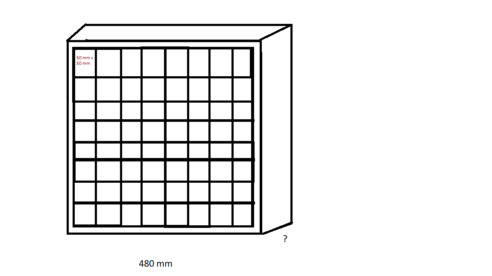

# Smart Chess Board

## Tabel Of Contents
1. [Goal Of The Project](#goal-of-the-project)

2. [Build the Board](#build-the-board)

3. [Become Smart](#become-smart)

4. [Print Figures](#print-figures)

5. [Build Suitcase](#build-suit-case)

## Goal Of The Project
The goal is to build a own chess board with the following functionality:

Inspired by

[YouTube-Video](https://youtube.com/shorts/w_YY8kvbV7I?si=iwk-sZpqzOtIxJl9)

https://www.youtube.com/watch?v=Z92TdhsAWD4&t=2s

Minimal Value Product:

V1:

1) Board Material: Wood and Epoxyresin
3) Chess Figues printed ab 3D Printer

V2:

2) Electronic: Posibitly to connect to App via Bluetooth
Additional:
________________________________________________________
4) Suitecase (e.g. Wooden)

## Build the Board

http://meder.spacechess.org/3dschach/bau.htm

Steps to do:

1) Layout

   [ ] Measueres of the board

   [X] Measures of each square inside the board

   [ ] Inside the board between the squares?

   [ ] Thickness
   

2) Appearence

   [ ] Choose Wood for the white quare

   [ ] Choose colors for Epoxyresin

3) Cut the wooden square

4) Build the Frame for the chess board

5) Add Smartness

##  Become Smart

First Info on [Youtube](https://www.youtube.com/watch?time_continue=758&v=zD9cv4JiNfE&embeds_referring_euri=https%3A%2F%2Fwww.bing.com%2F&embeds_referring_origin=https%3A%2F%2Fwww.bing.com&source_ve_path=Mjg2NjY&feature=emb_logo)

## Print Figures
https://www.youtube.com/watch?v=CvI87A9qkjo
### Design

### 3D Modelling

[Pawn](https://www.youtube.com/watch?v=CvI87A9qkjo)

### Print Figures

## Build Suitcase

## Research
Epoxy Amount Calculator:

https://epoxid1.de/products/allrounder-epoxidharz-mit-haerter?variant=39535058452669

Epoxy Colors:

[Epodex](https://www.epodex.com/en/product/metallic-carbon-red-jet-black-epoxy-resin-for-surfaces/)

https://www.epodex.com/de/produkt/epoxidharze-fuer-kunst-handwerk-verguesse-bis-2cm-eco-pro/?1=Coaster-Effect-Silver-%E2%80%93-2-Farben-%E2%80%93-10%2C99%E2%82%AC

https://www.epodex.com/de/produkt/epoxidharze-fuer-kunst-handwerk-verguesse-bis-2cm-eco-pro/

Germany:

https://epoxid1.de

https://www.epodex.us/product/epoxy-repair-and-glass-fiber-mat-kit/?1=Solid-Color-%E2%80%93-Azure-Blue&color=blue
